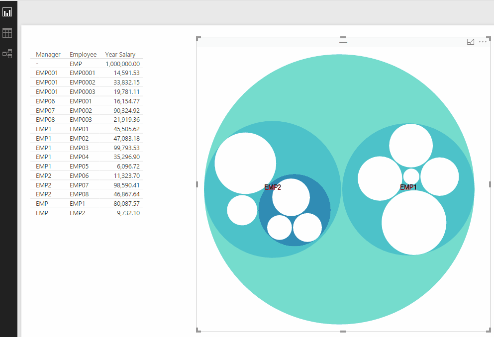

# Circle Packing - Power BI Custom Visual

This Power BI Custom Visual represents a hierarchy as a set of circles which can be drilled in to.

At present this is a basic implementation and I hope to expand on this in the future, updates will go through GIT of course.

Note your highest level MUST!!! have '-' as a parent 

Based on the excellent D3 code from Mike Bostock: http://bl.ocks.org/mbostock/7607535

See the sweat and tears here:
http://qlikanddirty.com/2016/10/04/zoomable-circle-packing-for-powerbi/

